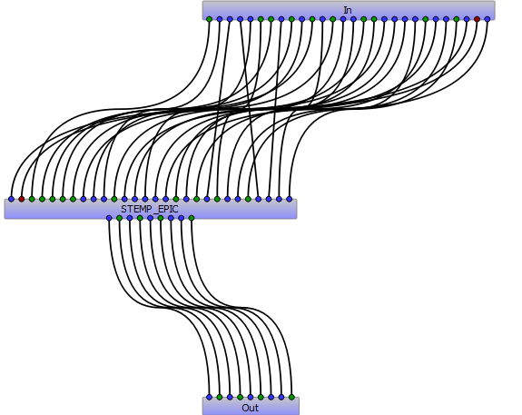

[](https://doi.org/10.5281/zenodo.4292231)


AgriculturalModelExchangeInitiative
===================================

The DSSAT soil temperature component, originally based on the EPIC soil temperature model and further improved by the DSSAT community

Project Organization
--------------------

```

    ├── LICENSE.txt        <- License file
    ├── README.md          <- The top-level README for AMEI members using this project.
    ├── data/              <- data used for model simulation
    │
    ├── doc/               <- Package documentation
    │
    ├── test/              <- model tests for each language and platform
    │
    ├── crop2ml/           <- model units and composite in crop2ml format.
    │      ├── xml files
    │      ├── Algo/
    │
    ├── original/          <- The initial implementation of the model component.
    │
    ├── src/               <- Executable source in different language and platform
    │   ├── pyx/
    │   ├── java/
    │   ├── py/
        ├── R/
        ├── cpp/
        ├── cs/
        ├── f90/
        ├── Bioma/
        ├── Sirius/
        ├── Simplace/
        ├── OpenAlea/
        ├── Record/
        ├── DSSAT/
   
```

Model visualization
-------------------


An example of transformation in OpenAlea
----------------------------------------




An example of unit test in R (Penman model unit)
------------------------------------------------


